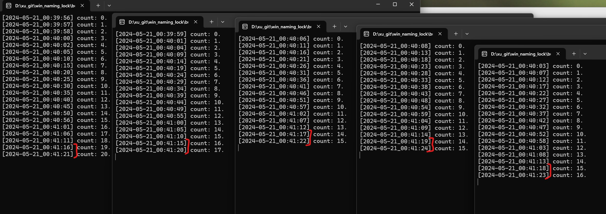

# win_naming_lock
This is a simple example shows Windows across processes naming locker.

I wrote this research project to seek how to sync between mutiple instance Windows application.

## Build steps:
1. clone the project.
2. cd to project root dir.
3. run below commands at MSVC environment.
```cmd
mkdir build
cd build
cmake ..
-- Building for: Visual Studio 17 2022
-- Selecting Windows SDK version 10.0.22000.0 to target Windows 10.0.22631.
-- The C compiler identification is MSVC 19.37.32825.0
-- The CXX compiler identification is MSVC 19.37.32825.0
-- Detecting C compiler ABI info
-- Detecting C compiler ABI info - done
-- Check for working C compiler: C:/Program Files/Microsoft Visual Studio/2022/Community/VC/Tools/MSVC/14.37.32822/bin/Hostx64/x64/cl.exe - skipped
-- Detecting C compile features
-- Detecting C compile features - done
-- Detecting CXX compiler ABI info
-- Detecting CXX compiler ABI info - done
-- Check for working CXX compiler: C:/Program Files/Microsoft Visual Studio/2022/Community/VC/Tools/MSVC/14.37.32822/bin/Hostx64/x64/cl.exe - skipped
-- Detecting CXX compile features
-- Detecting CXX compile features - done
-- Configuring done (2.7s)
-- Generating done (0.0s)
-- Build files have been written to: D:/xu_git/win_naming_lock/build
cmake --build .
适用于 .NET Framework MSBuild 版本 17.7.2+d6990bcfa

  Checking Build System
  Building Custom Rule D:/xu_git/win_naming_lock/CMakeLists.txt
  CNamingLock.cpp
  lib_cnaming_lock.vcxproj -> D:\xu_git\win_naming_lock\build\Debug\lib_cnaming_lock.lib
  Building Custom Rule D:/xu_git/win_naming_lock/CMakeLists.txt
  main.cpp
  lib_cnaming_lock_example.vcxproj -> D:\xu_git\win_naming_lock\build\Debug\lib_cnaming_lock_example.exe
  Building Custom Rule D:/xu_git/win_naming_lock/CMakeLists.txt
```

## Test:
Run mutiple test example `lib_cnaming_lock_example`, such as we launch 5 instances.



Each instance will sleep 1s and print time looply. So, 5 instances with naming lock, will slowed interval to 5s.